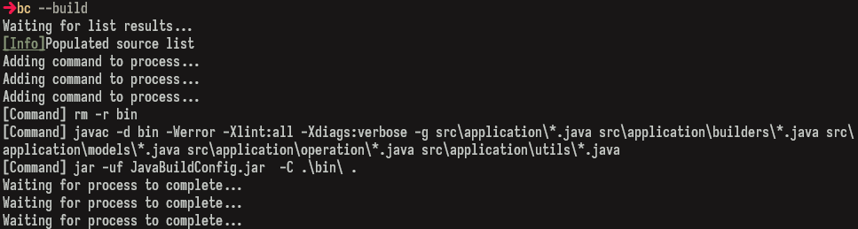
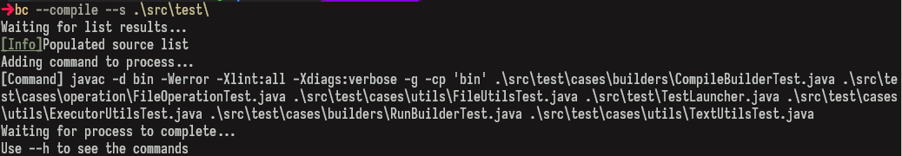

# Java build

- A java build tool that uses a **configuration file** to build the project.
> Its made for simple java project with minimal use of `.jar` dependencies.

- Build the entire project.


- Compile some other source.


---

## Usage

1. Go to the **releases** site,
on the project [build tool](https://github.com/AlfonsoG-dev/JavaBuildConfig)
and download either the `.exe` or `.jar` file.
2. When using the `.exe` file you might want to set it to path
in order to be able to use it.
> If you are on `linux` use the `.jar` file and make and executable.

## Build it yourself

This is a step by step guide on how to install this tool.

1. Download the source code of the project from [build tool](https://github.com/AlfonsoG-dev/JavaBuildConfig).
2. Build the project to get a `.jar` file to use.
> You can use the `.ps1` build script.

```sh
pwsh build.ps1
```

3. Execute the jar file with the *Java* `cli` tools.

```sh
java -jar App.jar
``` 

## Configuration

Use a `config.txt` file to store the project configuration.
> The following its an example of the configuration on this particular project.

```txt
Root-Path: src
Source-Path: src\application
Class-Path: bin
Main-Class: application.JavaBuildConfig
Test-Path: src\test
Test-Class: test.TestLauncher
Libraries: include/exclude/ignore
Compile--flags: -Werror
```

You can create the `config.txt` file with:

```sh
java -jar javaBuild.jar --config
```

- Once created you can change the values manually.

---

## Instructions

In this build tool you have the following commands:

1. Compile command:

- Use `--compile` to compile the project.

```sh
java -jar javaBuild.jar --compile
```

> You can use 3 sub-commands:
>
>- `--s sourcePath` to change the source path.
>- `--t classPath` to change the target path.
>- `--i` to include or not the lib files.
>- `--f` to insert flags to the compile process.

2. Run Command

- Use `--run` to execute the project.

```sh
java -jar javaBuild.jar --run
```

> You can use 4 sub-commands:
>
>- `src\app.java` to change the main class to execute.
>- `--s` to change the source path.
>- `--t` to change the target path.
>- `--i` to include or not the lib files.
>- `--f` to insert flags to the run process.

3. Create `jar` file

- Use `--jar` to create the build `.jar` file of the application.

```sh
java -jar javaBuild.jar --jar
```

>- `fileName` to change the `.jar` file name.

```sh
java -jar javaBuild.jar --jar app
```

>> Now the `.jar` file will be name `app.jar`
>- `--s` to change the source path.
>- `--t` to change the target path.
>- `-e` to change the entry point if manifesto isn't present.
>- `--f` to insert flags to the run process.

4. Build project

- It compile and creates the `.jar` file of the project.
> Just to save time you only enter this command instead of two.

```sh
java -jar javaBuild.jar --build
```

> It accepts the same command as compile but the `--f`
only works for compile not for `--jar` command.

```sh
java -jar javaBuild.jar --build --f -g
```

> The previous command will add `-g` flag to the compile process
enabling debug information.

5. Configuration

- It created or modifies the configuration and manifesto file

```sh
java -jar javaBuild.jar --config
```

> You can change the source by giving `--s src`
> You can change the target by giving `--t bin`
> You can change the main class by giving its name
>
>- You can also change the author of the project with `-a Owner-Mine`

```sh
java -jar javaBuild.jar --config src.App -a Owner-Mine
```

> You can "include/exclude" lib dependencies by giving `--i include/exclude`

---

## Disclaimer

- This project is for educational purposes.
- Security issues are not taken into account.
- Use it at your own risks.
- This project was made with the intention to create a build tool minimal
enough to compile, run, or build the project into a `.jar` file.
